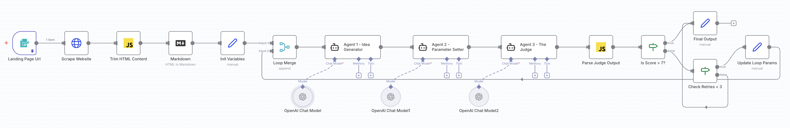

# Chapter 2: CRO Agent Chain with Critic Loop — Reference Guide

This reference guide contains all the prompts, schemas, and code you need to complete the exercises in Chapter 2.

---

## Workflow Summary

This workflow analyzes landing pages and generates Conversion Rate Optimization (CRO) ideas using a 3-agent chain with a quality feedback loop:



**The flow in simple terms:**
1. User submits a landing page URL, goal, and audience description
2. HTTP Request scrapes the page, Code node cleans HTML, Markdown converts to text
3. Loop variables initialize (retry counter and feedback context)
4. **Agent 1** generates 10 CRO optimization ideas (uses feedback on retries)
5. **Agent 2** defines 5 criteria to evaluate the ideas
6. **Agent 3** scores the ideas and provides critique
7. If average score > 7, output is accepted; otherwise retry with feedback (max 3 times)

---

## Trim HTML Content (Code Node)

This JavaScript extracts the `<main>` content or removes header/nav/footer as fallback:

```javascript
// Loop through all items
for (const item of items) {
  let html = item.json.data || '';
  let cleanContent = '';

  // Method 1: Try to extract everything inside the <main> tags
  // This regex looks for <main (any attributes)> ... content ... </main>
  // [\s\S]*? ensures we match across newlines
  const mainMatch = html.match(/<main[^>]*>([\s\S]*?)<\/main>/i);

  if (mainMatch && mainMatch[1]) {
    // If <main> is found, use that content directly (ignores header/footer automatically)
    cleanContent = mainMatch[1];
  } else {
    // Method 2: Fallback - Manually remove Header and Footer if <main> isn't found
    
    // Remove <header>...</header>
    html = html.replace(/<header[\s\S]*?<\/header>/i, '');
    
    // Remove <nav>...</nav>
    html = html.replace(/<nav[\s\S]*?<\/nav>/i, '');
    
    // Remove <footer>...</footer>
    html = html.replace(/<footer[\s\S]*?<\/footer>/i, '');

    cleanContent = html;
  }

  // Add the clean content to a new field
  item.json.cleaned_html = cleanContent.trim();
}

return items;
```

---

## Agent 1 — Idea Generator

### Define Prompt (Text)

```
You are a top-tier CRO Expert.

GOAL:
Analyze the landing page content provided below and generate 10 detailed, non-trivial Conversion Rate Optimization ideas.

CONTEXT:

Landing page URL: {{ $('Landing Page Url').item.json['Landing Page Url'] }}
Main goal of the page: {{ $('Landing Page Url').item.json['Main goal of the page'] }}
Audience descrition: {{ $('Landing Page Url').item.json['Audience description'] }}

Website Content: {{ $('Markdown').item.json.data }}

FEEDBACK FROM PREVIOUS ATTEMPT:
{{ $json.feedback_context ? $json.feedback_context : "This is the first attempt. No feedback yet." }}

INSTRUCTIONS:
1. If there is feedback, you MUST revise your previous ideas to address the critique.
2. Be specific and tactical.
3. Do not be boring.

Output your roast and recommendations clearly.
```

**Note:** This agent does NOT need a System Message or Structured Output Parser—it outputs free-form text.

---

## Agent 2 — Parameter Setter

### Define Prompt (Text)

```
You are a Senior Optimization Strategist.

TASK:
Review the CRO ideas generated by the previous agent. 

INPUT IDEAS:
{{ $json.output }}

ACTION:
Define 5 strict parameters/criteria to judge these ideas (e.g., Feasibility, Impact, Unconventionality, Clarity). 

Output ONLY the list of parameters.
```

**Note:** This agent does NOT need a System Message or Structured Output Parser—it outputs a simple list.

---

## Agent 3 — The Judge

### Define Prompt (Text)

```
You are a Harsh Judge.

TASK:
Evaluate the "Ideas" based strictly on the "Parameters" provided below.

IDEAS TO JUDGE:
{{ $('Agent 1 - Idea Generator').item.json.output }}

PARAMETERS:
{{ $json.output }}

OUTPUT FORMAT:
You must return Valid JSON ONLY. Do not include markdown formatting like ```json.
Do not calculate a total score.

You must provide a score (1-10) for these 5 specific criteria:
1. Clarity
2. Feasibility
3. Impact
4. Innovation
5. Adherence (to the input parameters)

Example Structure:
{
  "reasoning": "The idea is creative but completely ignores the budget constraints provided in the parameters...",
  "scores": {
    "Clarity": 8,
    "Feasibility": 3,
    "Impact": 6,
    "Innovation": 9,
    "Adherence": 2
  },
  "critique": "You need to strip back the expensive features. Keep the core hook but execute it using existing assets."
}
```

**Note:** This agent does NOT need a System Message or Structured Output Parser—the prompt enforces JSON output format.

---

## Parse Judge Output (Code Node)

This JavaScript parses the Judge's JSON output and calculates the average score:

```javascript
// Parse the JSON string from the AI Judge into an object n8n can read
try {
  const aiOutput = $input.item.json.output;
  
  // 1. Clean up if the AI added markdown code blocks
  const cleanJson = aiOutput.replace(/```json/g, '').replace(/```/g, '').trim();
  
  // 2. Parse the JSON
  const parsedOutput = JSON.parse(cleanJson);
  
  // 3. Calculate the Average Score
  let finalScore = 0;
  
  if (parsedOutput.scores) {
    const scoreValues = Object.values(parsedOutput.scores);
    const count = scoreValues.length;
    
    // Sum all values
    const sum = scoreValues.reduce((a, b) => a + Number(b), 0);
    
    // Calculate Average (prevent division by zero)
    if (count > 0) {
      // Calculate average and round to 1 decimal place (returns a string, so we wrap in Number)
      finalScore = Number((sum / count).toFixed(1));
    }
  }
  
  // 4. Append the calculated average to the final object
  parsedOutput.final_score = finalScore;
  
  return parsedOutput;

} catch (error) {
  return {
    "final_score": 0,
    "error": "Failed to parse JSON or calculate average",
    "raw_output": $input.item.json.output
  }
}
```

---

## Final Output (Set Node)

Package all results into a clean output:

| Field Name | Type | Value |
|------------|------|-------|
| Landing Page Url | String | `{{ $('Landing Page Url').item.json['Landing Page Url'] }}` |
| Main goal of the page | String | `{{ $('Landing Page Url').item.json['Main goal of the page'] }}` |
| Audience description | String | `{{ $('Landing Page Url').item.json['Audience description'] }}` |
| Ideas Generator | String | `{{ $('Agent 1 - Idea Generator').item.json.output }}` |
| Parameter | String | `{{ $('Agent 2 - Parameter Setter').item.json.output }}` |
| Judge | String | `{{ $('Agent 3 - The Judge').item.json.output }}` |

---

## Quick Reference: Node Connections

```
Landing Page Url (Form Trigger)
    → Scrape Website (HTTP Request)
    → Trim HTML Content (Code)
    → Markdown
    → Init Variables (Set)
    → Loop Merge (Input 1)

Loop Merge
    → Agent 1 - Idea Generator
    → Agent 2 - Parameter Setter
    → Agent 3 - The Judge
    → Parse Judge Output (Code)
    → Is Score > 7? (IF)

Is Score > 7?
    TRUE → Final Output (Set)
    FALSE → Check Retries < 3 (IF)

Check Retries < 3
    TRUE → Update Loop Params (Set) → Loop Merge (Input 2)
    FALSE → Final Output (Set)

OpenAI Chat Model
    → Agent 1 - Idea Generator
    → Agent 2 - Parameter Setter
    → Agent 3 - The Judge
```

