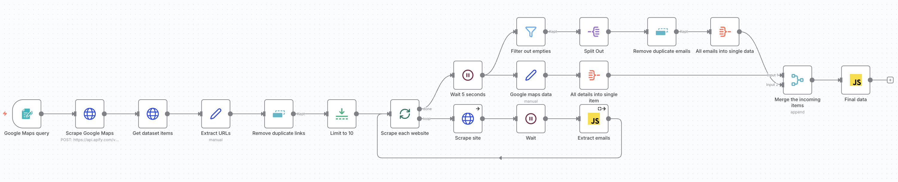

# Chapter 3: Google Maps Leads Scraper — Reference Guide

This reference guide contains all the configurations, code, and settings you need to complete the exercises in Chapter 3.

---

## Workflow Summary

This workflow scrapes Google Maps for business leads and extracts emails from their websites:



**The flow in simple terms:**
1. User submits a search query (e.g., "Plumbers") and location (e.g., "Miami, FL")
2. Apify scrapes Google Maps and returns business listings
3. Extract and clean website URLs (remove duplicates, limit to 10)
4. Loop through each website, scraping HTML and extracting emails via regex
5. Process two parallel streams: business details and extracted emails
6. Merge both streams and format the final output

---

## Getting Your Apify API Token

Before building the workflow, you need an Apify API token to authenticate API requests.

### Step 1: Get Your Apify API Token

1. Go to [apify.com](https://apify.com) and sign in (or create a free account)
2. Click your profile icon → **Settings** → **Integrations**
3. Copy your **Personal API Token**
4. Save it somewhere safe—you'll use it in HTTP Request headers

**Note:** We'll use HTTP Request nodes to call the Apify API directly (instead of a dedicated Apify node). This is a transferable skill for working with any REST API!

---

## Form Trigger Configuration

| Setting | Value |
|---------|-------|
| Form Title | `Lead scraper` |
| Form Description | _(optional)_ |

### Form Fields

| Field Label | Type | Required |
|-------------|------|----------|
| query | Text | ✅ Yes |
| location | Text | ✅ Yes |

---

## Calling Apify via HTTP Request

Since we're using HTTP Request nodes to call the Apify API, here's how the two requests work:

### Request 1: Run the Actor (POST)

This starts the Google Maps Scraper and waits for it to complete.

| Setting | Value |
|---------|-------|
| Method | POST |
| URL | `https://api.apify.com/v2/acts/nwua9Gu5YrADL7ZDj/runs?waitForFinish=300` |
| Authentication | None (we use headers instead) |
| Send Headers | ✅ Yes |
| Send Body | ✅ Yes |
| Body Content Type | JSON |

**Headers:**

| Name | Value |
|------|-------|
| Authorization | `Bearer YOUR_APIFY_TOKEN` |

**⚠️ Replace `YOUR_APIFY_TOKEN` with your actual Apify API token!**

**Body (JSON):**

```json
{
    "includeWebResults": false,
    "language": "en",
    "locationQuery": "{{ $json.location }}",
    "maxCrawledPlacesPerSearch": 50,
    "maxImages": 0,
    "maximumLeadsEnrichmentRecords": 0,
    "scrapeContacts": false,
    "scrapeDirectories": false,
    "scrapeImageAuthors": false,
    "scrapePlaceDetailPage": false,
    "scrapeReviewsPersonalData": true,
    "scrapeSocialMediaProfiles": {
        "facebooks": false,
        "instagrams": false,
        "tiktoks": false,
        "twitters": false,
        "youtubes": false
    },
    "scrapeTableReservationProvider": false,
    "searchStringsArray": [
        "{{ $json.query }}"
    ],
    "skipClosedPlaces": false
}
```

### Request 2: Get Dataset Items (GET)

This retrieves the scraped business listings from the dataset.

| Setting | Value |
|---------|-------|
| Method | GET |
| URL | `https://api.apify.com/v2/datasets/{{ $json.data.defaultDatasetId }}/items?limit=10` |
| Authentication | None (we use headers instead) |
| Send Headers | ✅ Yes |

**Note:** The API response wraps everything in a `data` object, so we use `$json.data.defaultDatasetId` (not `$json.defaultDatasetId`).

**Headers:**

| Name | Value |
|------|-------|
| Authorization | `Bearer YOUR_APIFY_TOKEN` |

**⚠️ Use the same API token as Request 1!**

---

## Extract URLs (Set Node)

Extract the website field from each Apify result:

| Field Name | Type | Value |
|------------|------|-------|
| website | String | `{{ $json.website }}` |

---

## Data Cleaning Nodes

### Remove Duplicate Links

| Setting | Value |
|---------|-------|
| Compare | All fields |
| Keep | First occurrence |

### Limit to 10

| Setting | Value |
|---------|-------|
| Max Items | 10 |

---

## Split In Batches Configuration

| Setting | Value |
|---------|-------|
| Batch Size | 1 (process one at a time) |

**Outputs:**
- **Output 1 (top)**: Items that have been processed (done)
- **Output 2 (bottom)**: Current batch item to process

---

## Scrape Site (HTTP Request)

| Setting | Value |
|---------|-------|
| URL | `{{ $json.website }}` |
| Follow Redirects | ✅ Yes |
| Max Redirects | 5 |
| On Error | Continue (don't stop workflow) |

---

## Wait Nodes

### Wait (after scraping)

| Setting | Value |
|---------|-------|
| Amount | 1 second |

### Wait 5 seconds (after batch completes)

| Setting | Value |
|---------|-------|
| Amount | 5 seconds |

---

## Extract Emails (Code Node)

This JavaScript uses regex to find email addresses in the scraped HTML:

```javascript
// Safely get input data with null checks
const inputItem = $input.first();
const input = inputItem?.json?.data || '';

// Email regex that excludes common image extensions
const regex = /[a-zA-Z0-9._%+-]+@[a-zA-Z0-9.-]+\.(?!jpeg|jpg|png|gif|webp|svg|ico|bmp|tiff)[a-zA-Z]{2,}/g;

// Match emails, default to empty array if no matches
const emails = input.match(regex) || [];

return {json: {emails: emails}}
```

**Settings:**
- Always Output Data: ✅ Yes
- On Error: Continue Regular Output

---

## Google Maps Data (Set Node)

Extract business details to preserve alongside emails:

| Field Name | Type | Value |
|------------|------|-------|
| title | String | `{{ $('Get dataset items').item.json.title }}` |
| categoryName | String | `{{ $('Get dataset items').item.json.categoryName }}` |
| address | String | `{{ $('Get dataset items').item.json.address }}` |
| website | String | `{{ $('Get dataset items').item.json.website }}` |
| phone | String | `{{ $('Get dataset items').item.json.phone }}` |
| emails | String | `{{ $json.emails }}` |
| location | String | `{{ $('Get dataset items').item.json.city }}` |

---

## Filter Out Empties (Filter Node)

Only keep items that have emails:

| Setting | Value |
|---------|-------|
| Field | `{{ $json.emails }}` |
| Condition | Array exists |

---

## Split Out Node

Flatten the emails array so each email becomes a separate item:

| Setting | Value |
|---------|-------|
| Field to Split Out | `emails` |

---

## Remove Duplicate Emails

| Setting | Value |
|---------|-------|
| Compare | All fields |
| Keep | First occurrence |

---

## Aggregate Nodes

### All Details Into Single Item

Combines all business data items into a single array:

| Setting | Value |
|---------|-------|
| Aggregate | All Item Data |

### All Emails Into Single Data

Combines all email items into a single array:

| Setting | Value |
|---------|-------|
| Aggregate | All Item Data |

---

## Merge the Incoming Items

Combines the two parallel streams:

| Setting | Value |
|---------|-------|
| Mode | Append |
| Number of Inputs | 2 |

**Connections:**
- Input 1: All details into single item (business data)
- Input 2: All emails into single data (email data)

---

## Final Data (Code Node)

This JavaScript formats the final output, matching emails to businesses by domain:

```javascript
try {
  // Extract data from the incoming structure
  let businessData = [];
  let emailListData = [];

  // Check if we have the expected structure
  if (Array.isArray(items) && items.length > 0) {
    // Get business data
    if (items[0] && items[0].json && items[0].json.data) {
      businessData = items[0].json.data;
    } else if (items[0] && items[0].data) {
      businessData = items[0].data;
    } else if (Array.isArray(items[0])) {
      businessData = items[0];
    } else if (items[0] && items[0].json) {
      businessData = items[0].json;
    }
    
    // Get email list data
    if (items[1] && items[1].json && items[1].json.data) {
      emailListData = items[1].json.data;
    } else if (items[1] && items[1].data) {
      emailListData = items[1].data;
    } else if (Array.isArray(items[1])) {
      emailListData = items[1];
    } else if (items[1] && items[1].json) {
      emailListData = items[1].json;
    }
  }

  // If no data was extracted, check if items itself is the data
  if (businessData.length === 0 && Array.isArray(items)) {
    const firstItem = items[0];
    if (firstItem && (firstItem.categoryName || firstItem.title)) {
      businessData = items;
    }
  }

  // Create a map to store unique valid emails from email list
  const validEmailsFromList = new Set();

  // Process email list data to extract valid emails
  if (Array.isArray(emailListData)) {
    emailListData.forEach(emailObj => {
      if (emailObj && emailObj.emails) {
        const email = emailObj.emails.trim().toLowerCase();
        
        // Filter out invalid/sentry emails
        if (email && 
            email.includes('@') &&
            !email.includes('sentry') &&
            !email.includes('wixpress') &&
            !email.includes('example@mysite.com') &&
            email.length > 5) {
          validEmailsFromList.add(email);
        }
      }
    });
  }

  // Format the business data
  const formattedBusinesses = [];

  if (Array.isArray(businessData) && businessData.length > 0) {
    businessData.forEach(business => {
      if (!business) return;
      
      // Use title for company name (from Apify Google Maps), fallback to categoryName
      const formattedBusiness = {
        companyName: business.title || business.name || "Unknown Business",
        businessType: business.categoryName || "Unknown",
        address: business.address || "Address not available",
        website: business.website || "",
        phone: business.phone ? business.phone.replace(/[^\d+]/g, '') : "",
        emails: [],
        city: business.city || ""
      };

      // Try to extract city from address if not provided
      if (!formattedBusiness.city && business.address) {
        const addressParts = business.address.split(', ');
        if (addressParts.length >= 2) {
          formattedBusiness.city = addressParts[addressParts.length - 2] || "";
        }
      }

      // Process emails from the business object
      if (business.emails) {
        try {
          if (typeof business.emails === 'string' && business.emails.startsWith('[')) {
            const emailArray = JSON.parse(business.emails);
            const validEmails = new Set();
            
            if (Array.isArray(emailArray)) {
              emailArray.forEach(email => {
                const cleanEmail = email.trim().toLowerCase();
                if (cleanEmail && 
                    cleanEmail.includes('@') &&
                    !cleanEmail.includes('sentry') &&
                    !cleanEmail.includes('wixpress') &&
                    !cleanEmail.includes('example@mysite.com') &&
                    cleanEmail.length > 5) {
                  validEmails.add(cleanEmail);
                }
              });
            }
            
            formattedBusiness.emails = Array.from(validEmails);
          } else if (typeof business.emails === 'string') {
            const cleanEmail = business.emails.trim().toLowerCase();
            if (cleanEmail && 
                cleanEmail.includes('@') &&
                !cleanEmail.includes('sentry') &&
                !cleanEmail.includes('wixpress') &&
                !cleanEmail.includes('example@mysite.com') &&
                cleanEmail.length > 5) {
              formattedBusiness.emails = [cleanEmail];
            }
          }
        } catch (e) {
          // Error parsing, skip emails
        }
      }

      // Add relevant emails from the scraped email list
      if (formattedBusiness.website) {
        try {
          const domainMatch = formattedBusiness.website.match(/https?:\/\/(?:www\.)?([^\/]+)/);
          if (domainMatch) {
            const domain = domainMatch[1].toLowerCase();
            validEmailsFromList.forEach(email => {
              if (email.includes(domain.split('.')[0])) {
                if (!formattedBusiness.emails.includes(email)) {
                  formattedBusiness.emails.push(email);
                }
              }
            });
          }
        } catch (e) {
          // Skip if error
        }
      }

      // Remove duplicate emails
      formattedBusiness.emails = [...new Set(formattedBusiness.emails)];

      formattedBusinesses.push(formattedBusiness);
    });
  }

  // Return formatted results
  const result = formattedBusinesses.map(business => ({
    json: business
  }));
  
  return result;
  
} catch (error) {
  console.error('Error in Code node:', error);
  return [{ json: { error: error.message, note: "Processing failed but workflow continues" } }];
}
```

---

## Important: Verify Node Names in Expressions

The configurations above use expressions like `$('Get dataset items')` to reference data from other nodes. **These names must match your actual node names exactly.**

Before pasting configurations, check that:
- Your Form Trigger is named appropriately
- Your Apify nodes match the names in expressions
- All node names referenced in Code nodes exist

If your node names differ, update the expressions to match.

---

## Quick Reference: Node Connections

```
On form submission
    → Run an Actor
    → Get dataset items
    → Extract URLs
    → Remove Duplicate links
    → Limit to 10
    → Scrape each website
        ├── Output 1 → Wait 5 seconds → Google maps data → All details into single item
        │                            → Filter Out Empties → Split Out → Remove Duplicate emails → All emails into single data
        └── Output 2 → Scrape Site → Wait → Extract Emails → (back to Scrape each website)

All details into single item → Merge the incoming items (Input 1)
All emails into single data → Merge the incoming items (Input 2)

Merge the incoming items → Final data
```

---

## Key Concepts in This Workflow

| Concept | Where It's Used |
|---------|-----------------|
| Form Trigger | User input (query + location) |
| Apify integration | External API for Google Maps scraping |
| Set node | Extract specific fields |
| Remove Duplicates | Clean URLs and emails |
| Limit node | Cap number of items |
| Split In Batches | Loop through items one at a time |
| Wait node | Rate limiting between requests |
| Code node (Regex) | Extract emails from HTML |
| Filter node | Remove empty results |
| Split Out | Flatten arrays |
| Aggregate | Combine items into single array |
| Merge | Join parallel data streams |
| Code node (formatting) | Structure final JSON output |
